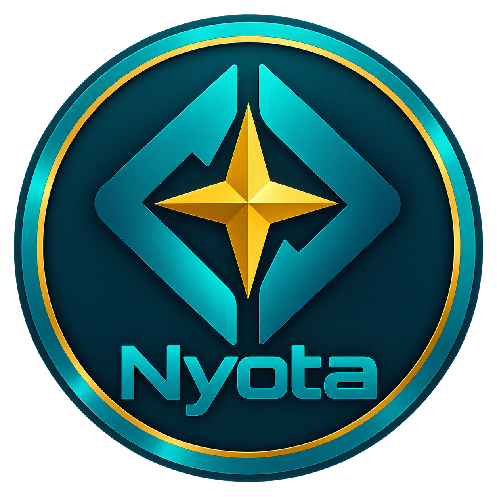

<p align="center">
  
</p>

<h1 align="center">Nyota</h1>

<p align="center">
  <strong>Autorski język programowania AyoOS — prosty, jawny, przenośny i rozwijany razem z własnym NyotaUI.</strong>
</p>

<p align="center">
  
  
  
  
  
</p>

---

## Czym jest Nyota?

**Nyota** to własny język programowania tworzony dla **AyoOS**, ale projektowany tak, aby sam język nie był zależny od jednego edytora ani jednego systemu operacyjnego.

**To repozytorium zawiera zarówno rdzeń języka, jak i działającą hostową warstwę NyotaUI dla POSIX/Linux.** Rdzeń interpretera (`src/nyota.c`) definiuje składnię i semantykę Nyoty, natomiast `host/posix/` realizuje okna `WIN` i kontrolki NyotaUI przez SDL2. Te warstwy są rozdzielone przez `NyotaHost`, dzięki czemu kod `.nyo` nie zależy od SDL2.

AyoOS jest pierwszym systemem-hostem Nyoty. Równolegle rozwijany jest host dla Linuksa, a architektura interpretera rozdziela rdzeń języka od warstwy platformowej.

**Tunga** jest osobnym edytorem i nie stanowi części Nyoty. Docelowo ten sam kod `.nyo` ma być uruchamiany przez różne środowiska bez zmiany semantyki języka.

Nyota stawia na:

- czytelną składnię opartą o wcięcia,
- jawne typy i brak ukrytych konwersji,
- `:=` do przypisania i ścisłe `=` do porównania typu oraz wartości,
- proste funkcje i procedury,
- struktury danych przydatne w codziennym programowaniu,
- wbudowane możliwości systemowe i graficzne,
- własny, działający na POSIX/Linux model GUI **NyotaUI**,
- host-neutralny kontrakt interfejsu przygotowany do tego samego kodu `.nyo` na AyoOS i innych hostach.

---

## Krótki przykład

```nyota
FUNCTION Dodaj(a, b):
    RETURN a + b

BEGIN
VAR data := <2026.09.17>
VAR wynik := Dodaj(2, 3)

IF YEAR(data) = 2026:
    PRINT wynik

FOR i := 0 TO 10 STEP 5:
    PRINT i
END
```

> **Na hoście Linux/POSIX działa już NyotaUI:** okna `WIN`, zakładki `TABS/TAB`, kontenery i rozbudowany zestaw kontrolek. To warstwa hosta Nyoty, nie osobny język — ten sam kod `.nyo` korzysta ze wspólnego kontraktu `NyotaHost`. Repo zawiera m.in. działające showcase/testy [`tests/win_modern_controls.nyo`](tests/win_modern_controls.nyo) oraz [`tests/win_advanced_controls.nyo`](tests/win_advanced_controls.nyo).

Najważniejsze reguły widoczne już w tym przykładzie:

```text
.nyo        rozszerzenie plików źródłowych
BEGIN/END   rama kodu wykonywalnego
4 spacje    jeden poziom wcięcia
:=          przypisanie
=           ścisłe porównanie typu i wartości
```

---

## NyotaUI — GUI jest częścią Nyoty

**NyotaUI jest już działającą częścią projektu, a nie planowaną biblioteką GUI.** Na hoście POSIX/Linux Nyota potrafi tworzyć prawdziwe okna `WIN`, zakładki, kontenery, pola wejściowe, listy, drzewa, suwaki, wskaźniki i rozbudowane kontrolki wizualizacyjne.

NyotaUI nie jest osobnym językiem ani bezpośrednim wrapperem na SDL2. Kod programu opisuje interfejs w składni Nyoty, a warstwa `NyotaHost` realizuje ten sam kontrakt na konkretnej platformie. Obecny backend POSIX korzysta z SDL2, SDL2_image, SDL2_ttf i fontconfig; docelowy backend AyoOS ma realizować tę samą semantykę przez własny stos graficzny bez zmiany kodu `.nyo`.

### Model

```text
program .nyo
    │
    ├── WIN
    │    ├── PANEL / FRAME / TABS / TOOLBAR / STATBAR
    │    │      └── kontrolki potomne
    │    └── kontrolki bezpośrednie
    │
    ├── wspólne .CONFIG
    ├── kolory / PNG / gradienty / radius / glow
    ├── FREE / ROW / COL / AUTO / CENTER
    └── zdarzenia i odczyt stanu
            │
            ▼
        NyotaHost
      ┌─────┴──────────────┐
      ▼                    ▼
 POSIX / SDL2          AyoOS
 działa dziś           docelowy backend
```

Wspólny model kontrolek jest prosty: obiekt ma nazwę, rodzica, geometrię i właściwości. Rozbudowane ustawienia można przenieść do bloku `.CONFIG:`, dzięki czemu nawet większe interfejsy pozostają czytelne.

### NyotaUI dzisiaj

| Obszar | Dostępne elementy |
|---|---|
| **Okna i kontenery** | `WIN`, `PANEL`, `FRAME`, `TABS/TAB`, `TOOLBAR`, `STATBAR` |
| **Tekst i wejście** | `LABEL`, `INPUT`, `TBOX`, `TAREA`, `SPINBOX` |
| **Wybór i sterowanie** | `BUTTON`, `ICONBUTTON`, `CBOX`, `RADIO`, `COMBO`, `TOGGLE`, `SLIDER`, `SBAR`, `SPLITTER` |
| **Dane i struktury** | `TABLE`, `LISTVIEW`, `TREEVIEW`, `DAREA` |
| **Postęp i wizualizacja** | `PBAR`, `EQBOX` |
| **Skale i telemetria** | liniowa/obrotowa `SCALE`, wielowskazówkowy `CLOCK` |
| **Layout** | `FREE`, `ROW`, `COL`, pozycje `AUTO` i `CENTER` |
| **Warstwa wizualna** | kolory Nyoty, PNG, gradienty liniowe/kształtowe/spiralne, `RADIUS`, bordery, padding, shadow, glow |
| **Interakcja** | focus klawiatury, `Tab/Shift+Tab`, hover, pressed, disabled, sterowanie myszą i klawiaturą |
| **Renderowanie** | antyaliasowany tekst UTF-8, fonty systemowe, zaokrąglone clippingi, logiczne HiDPI |

NyotaUI wykracza już poza klasyczne formularze. `EQBOX` może działać jako wielosłupkowy wizualizator danych z segmentami, gradientami, peak-hold i glow. `SCALE` obsługuje skale liniowe, łukowe i pełne obrotowe, a `CLOCK` jest wielowskazówkowym instrumentem telemetrycznym z niezależnymi zakresami, strefami i własnym wyglądem wskazówek.

### Przykład

```nyota
BEGIN
WIN app, ROOT, [900, 620], CENTER, TRUE

WIN app.CONFIG:
    TITLE = "NyotaUI"
    BG = DARKSAPPHIRE

FRAME settings, app, [380, 300], [20, 20], TEXT="System"

FRAME settings.CONFIG:
    BG = DARKGRAY
    BORDER = TRUE
    CBORDER = SAPPHIRE
    RADIUS = 10
    LAYOUT = COL
    GAP = 10
    LPADX = 16
    LPADY = 28

INPUT search, settings, [320, 38], AUTO, TYPE=SEARCH, PLACEHOLDER="Szukaj...", CLEARBUTTON=TRUE
TOGGLE wifi, settings, [92, 34], AUTO, VALUE=TRUE
ICONBUTTON save, settings, [140, 38], AUTO, TEXT="Zapisz"

TREEVIEW tree, app, [440, 540], [430, 20], ITEMS=["System", "System/CPU", "System/GPU", "Storage", "Storage/NVMe"], EXPANDED=[0, 3]

END
```

Ten kod pozostaje kodem Nyoty. Program nie zawiera wywołań SDL2 ani typów hosta.

### Działające przykłady w repo

Najbardziej reprezentatywne programy demonstracyjne są już częścią repozytorium:

- [`tests/win_modern_controls.nyo`](tests/win_modern_controls.nyo) — `FRAME`, `INPUT`, `TOGGLE`, `ICONBUTTON`, `TREEVIEW`;
- [`tests/win_advanced_controls.nyo`](tests/win_advanced_controls.nyo) — `TBOX`, `SPINBOX`, `LISTVIEW`, `TREEVIEW`, `SPLITTER`, liniowe i obrotowe `SCALE`, wielowskazówkowy `CLOCK`;
- [`tests/win_extra_controls.nyo`](tests/win_extra_controls.nyo) — `TOOLBAR`, `SLIDER`, `EQBOX`, `STATBAR`.

Po zbudowaniu hosta można uruchomić je bezpośrednio:

```bash
./nyota tests/win_modern_controls.nyo
./nyota tests/win_advanced_controls.nyo
./nyota tests/win_extra_controls.nyo
```

`make test-graph` uruchamia również testy graficzne w trybie automatycznym.

Pełny kontrakt, właściwości kontrolek i szczegóły backendu są opisane w [`docs/nyotaui.md`](docs/nyotaui.md).

---

## Stan projektu

Nyota jest aktywnie rozwijana. Rdzeń interpretera jest już używalny, ale część bardziej rozbudowanych elementów pozostaje w trakcie stabilizacji.

| Obszar | Stan | Uwagi |
|---|:---:|---|
| `BEGIN / END`, komentarze, 4-spacjowe wcięcia | ✅ | interpreter egzekwuje strukturę programu |
| Wyrażenia i precedencja operatorów | ✅ | m.in. `*`, `/`, `+`, `-`, `MOD`, nawiasy, logika |
| `IF / ELIF / ELSE` | ✅ | jeden spójny łańcuch warunkowy |
| `FOR ... STEP`, `WHILE`, `CONTINUE` | ✅ | podstawowe sterowanie przepływem |
| `FUNCTION`, `PROCEDURE`, `RETURN`, zakresy | ✅ | wywołania funkcji działają także w wyrażeniach |
| Ścisłe typowanie i jawne konwersje | 🚧 | system typów jest intensywnie dopracowywany |
| `DATE` | ✅ | literał `<RRRR.MM.DD>`, walidacja gregoriańska i arytmetyka dni |
| `LIST` | 🚧 | rozszerzane operacje i semantyka kolekcji |
| `MARK` | ✅ | klucze+kolumny, algebra, iteracja, sortowanie, przebudowa kolumn i statystyki |
| `NyotaUI / WIN` | ✅ / 🚧 | działające GUI na POSIX/Linux: okna, kontenery, formularze, `TABS/TAB`, listy/drzewa, layout, `EQBOX`, `SCALE`, `CLOCK`, obrazy, gradienty, UTF-8, focus i HiDPI; API nadal jest rozwijane |
| `TABLE` | ✅ | jedna z kontrolek NyotaUI do prezentacji LIST/TUPLE/MARK |
| `SPRITE` | ✅ | nazwany obiekt graficzny; ruch, widoczność, animacja klatkowa, jawne rysowanie i kolizja AABB |
| `FILE / DIR / LS` | ✅ | wysokopoziomowy kontrakt hosta; pełny backend POSIX |
| `RECORD / WITH` | ✅ | rekordy z blokadą typów i kontekstem pól |
| `IMPORT` | ✅ | bezpieczny import deklaracji przed BEGIN |
| `EVERY / ON ERROR` | ✅ | scheduler kooperacyjny i handler błędów |
| `SCREEN` | ✅ | cele off-screen; backend POSIX/SDL2 |
| `SORT` | ✅ | AUTO + 8 jawnych algorytmów, ASC/DESC/REVERSE |
| `NYASM` | ✅ | bezpieczna VM R0-R3 z jawnym INPUT/OUTPUT |
| Host Linux | 🚧 | terminal + SDL2 / SDL2_image / SDL2_ttf / fontconfig dla grafiki, NyotaUI i FILE/DIR |
| Host AyoOS | 🚧 | docelowo wspólny `src/nyota.c` dla wszystkich hostów |
| VS Code | ✅ | Nyota Language Support 0.5.4: kolorowanie + uruchamianie przez `▶` / `Ctrl+F5` + próbki/picker kolorów NyotaUI |

Szczegółowy stan interpretera znajduje się w [`docs/nyota.md`](docs/nyota.md), a droga do stabilizacji i rozwoju w [`docs/nyota_v05.md`](docs/nyota_v05.md).

---

## Budowanie na Linuksie

Aktualny host POSIX/Linux jest budowany z kodu C i korzysta z SDL2.

### Wymagania

```text
kompilator C zgodny z C11 (np. GCC)
make
pkg-config
SDL2 wraz z plikami deweloperskimi
SDL2_image wraz z plikami deweloperskimi
SDL2_ttf wraz z plikami deweloperskimi
fontconfig wraz z plikami deweloperskimi
```

### Kompilacja

```bash
git clone https://github.com/Klucznik26/Nyota.git
cd Nyota
git switch nyota-v05-complete
make
```

Powstanie plik wykonywalny:

```text
./nyota
```

### Uruchomienie programu

```bash
./nyota program.nyo
```

Na przykład:

```bash
./nyota tests/core_demo.nyo
```

Aktualny program hosta przyjmuje plik `.nyo` jako pierwszy argument.

---

## Testy

Repozytorium zawiera zestaw programów regresyjnych w katalogu `tests/`.

```bash
make test
```

Testy obejmują między innymi parser wyrażeń, typy, błędy składni i wykonania, funkcje, pętle, daty, listy oraz rozwijany `MARK`.

Bez `GRAPH` program pisze na stdout. Po `GRAPH 1..6` otwiera się okno SDL.
`PRINT` po `GRAPH` jest błędem języka. Okno czeka na ESC.

```bash
./nyota tests/graph_box.nyo
make test-graph
NYOTA_INPUT=hello ./nyota tests/input_hello.nyo
```

Duży test demonstracyjny rdzenia:

```bash
./nyota tests/core_demo.nyo
```

## RPM (Fedora)

Pakiet jest budowany i testowany natywnie w środowisku Fedora 44. Do lokalnego
zbudowania potrzebne są narzędzia RPM i nagłówki zgodności SDL2:

```bash
sudo dnf install rpm-build gcc make pkgconf-pkg-config sdl2-compat-devel SDL2_image-devel SDL2_ttf-devel fontconfig-devel tar gzip
make rpm
sudo dnf install packaging/nyota-0.5.0-24.fc44.x86_64.rpm
nyota /usr/share/nyota/tests/add_int.nyo
```

`make rpm` tworzy zarówno RPM binarny, jak i SRPM w katalogu `packaging/`.
Fedora 44 dostarcza `pkgconfig(sdl2)` przez `sdl2-compat-devel`; NyotaUI korzysta także z SDL2_image, SDL2_ttf i fontconfig. Zależności runtime są wykrywane automatycznie przez RPM. Pakiet zawiera
również programy testowe, zasób BMP do testów SPRITE oraz dokumentację projektu.

Workflow `Fedora RPM` buduje pakiet na Fedorze 44, instaluje go w czystym
kontenerze i wykonuje test uruchomieniowy. Gotowe RPM-y są zapisywane jako
artefakt workflow `nyota-fedora-44-rpm`.

---

## Architektura

```text
Nyota source (.nyo)
        │
        ▼
  src/nyota.c
  interpreter core
        │
        ▼
 src/nyota_host.h
  host contract
      ┌─┴───────────────┐
      ▼                 ▼
 host/posix/        host/ayoos/
 Linux + SDL2       AyoOS
```

Architektura rozdziela dwie rzeczy, które w praktyce rozwijają się równolegle:

- **rdzeń języka** — parser, typy, sterowanie przepływem, `MARK`, `RECORD`, `IMPORT`, `SORT`, `NYASM`, kontrakt `WIN`/kontrolek i pozostała semantyka w `src/`;
- **warstwę hosta/UI** — kod, który na POSIX/Linux rzeczywiście otwiera okna i renderuje NyotaUI przez SDL2, SDL2_image, SDL2_ttf i fontconfig w `host/posix/`.

Polecenia języka takie jak `PRINT`, `GRAPH`, `INPUT` czy `DELAY` oraz obiekty NyotaUI należą do Nyoty; host dostarcza ich wykonanie dla konkretnego systemu. Dzięki temu działające dziś okno POSIX/SDL2 nie oznacza uzależnienia języka od SDL2 — jest jedną implementacją wspólnego kontraktu `NyotaHost`.

Interpreter udostępnia również punkt wejścia do osadzania:

```c
void NyotaEmbedRun(const char *src, void (*emit)(char c));
```

Dzięki temu Nyota może być uruchamiana z różnych edytorów i środowisk bez tworzenia osobnej odmiany języka.

---

## Struktura repozytorium

```text
src/
    nyota.c          interpreter
    nyota_host.h     kontrakt hosta

host/
    posix/           host Linux / SDL2
    ayoos/           integracja AyoOS

docs/
    nyota.md         bieżąca specyfikacja i stan interpretera
    nyota_v05.md     plan stabilizacji i rozwoju
    do_wdrożenia.md  dalsze elementy do wdrożenia

tests/               programy testowe .nyo
scripts/             automatyzacja testów
editors/vscode/      rozszerzenie VS Code: .nyo + kolorowanie + uruchamianie
Makefile             budowanie hosta Linux
```

---

## Dokumentacja

Najważniejsze dokumenty projektu:

- [`docs/nyota.md`](docs/nyota.md) — bieżące zasady języka i faktyczny stan interpretera,
- [`docs/nyota_v05.md`](docs/nyota_v05.md) — plan stabilizacji oraz zatwierdzone kierunki rozwoju,
- [`docs/nyotaui.md`](docs/nyotaui.md) — pełny kontrakt NyotaUI: okna, kontenery, kontrolki, layout, wejście tekstowe, listy/drzewa, `SCALE`, `CLOCK`, `EQBOX`, obrazy, gradienty, focus, HiDPI i warstwa wizualna,
- [`docs/do_wdrożenia.md`](docs/do_wdrożenia.md) — elementy oczekujące na implementację,
- [`docs/zasadymd.md`](docs/zasadymd.md) — sposób oznaczania stanu prac w dokumentacji.

---

## Kierunek rozwoju

**NyotaUI nie jest elementem przyszłej roadmapy — działa już dziś na hoście POSIX/Linux.** Dalszy rozwój GUI oznacza rozszerzanie istniejącego NyotaUI, dopracowywanie kontrolek i dodawanie kolejnych backendów hosta, przede wszystkim dla AyoOS. Równolegle Nyota ma rozwijać bogatsze struktury danych, `DATETIME`, relacyjny `MARK`, `TABLE`, audio i sprite'y.

Poza AyoOS działa rozszerzenie **Nyota Language Support 0.5.4** dla **Visual Studio Code**: rozpoznaje `.nyo`, koloruje składnię, automatycznie normalizuje wpisane polecenie `eqbox` do `EQBOX` i uruchamia aktualny program przez przycisk `▶`, `Ctrl+F5` albo komendę `Nyota: Run Current File`. Interpreter jest pobierany z `PATH` lub z ustawienia `nyota.interpreterPath`. Wersja 0.5.4 zna pełną składnię v0.5 oraz rozwiniętą składnię NyotaUI `WIN`, `BUTTON`, `LABEL`, `PANEL`, `DAREA`, `CBOX`, `RADIO`, `COMBO`, `SEP`, `TABS`, `TAB`, `TAREA`, `SBAR`, `PBAR`, `EQBOX`, `SLIDER`, `STATBAR`, `TOOLBAR`, `TBOX`, `INPUT`, `ICONBUTTON`, `TOGGLE`, `FRAME`, `SPINBOX`, `LISTVIEW`, `TREEVIEW`, `SPLITTER`, `SCALE`, `CLOCK`, `IMG` i `GRAD`, w tym FILE/DIR, SCREEN, RECORD/WITH, IMPORT, EVERY, obsługę błędów, jawne algorytmy SORT i NYASM. Kolejne etapy mogą dodać diagnostykę i podpowiedzi. Nadal planowane są też pakiety Linuksa — w pierwszej kolejności dla **Fedory** i **openSUSE**.

Nyota nie ma zastępować C lub Zig w najniższych warstwach systemu. Jej celem jest wygodne tworzenie aplikacji, narzędzi, automatyzacji, grafiki i prostych gier przy zachowaniu własnej, spójnej semantyki.

---

<p align="center">
  <strong>Nyota jest częścią świata AyoOS, ale język ma żyć także poza nim.</strong>
</p>
